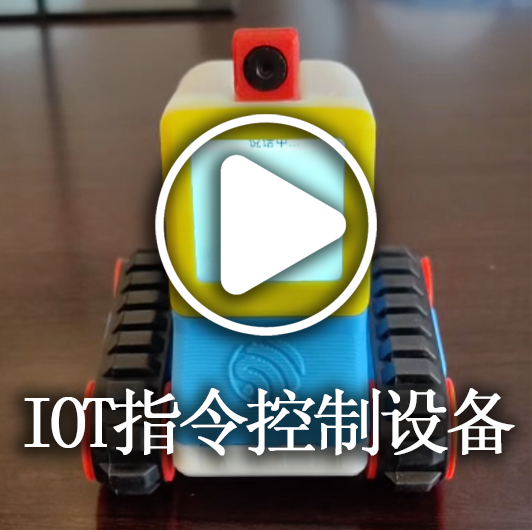
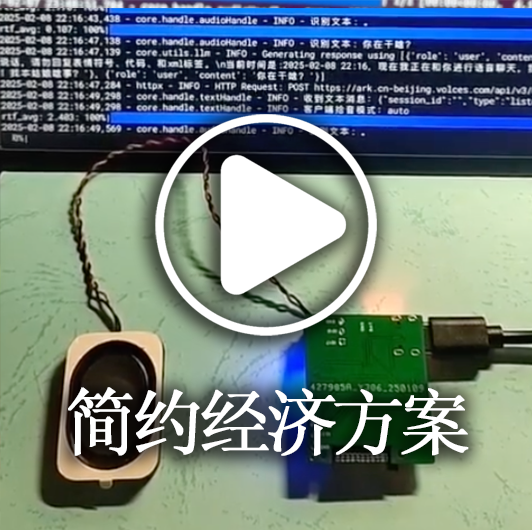
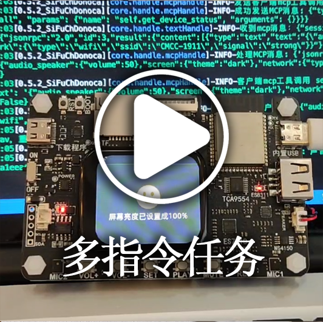
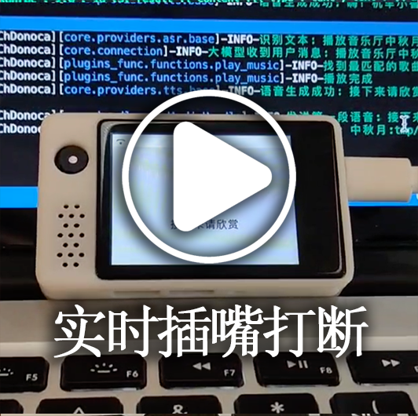
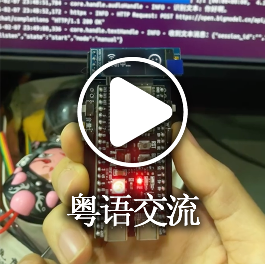
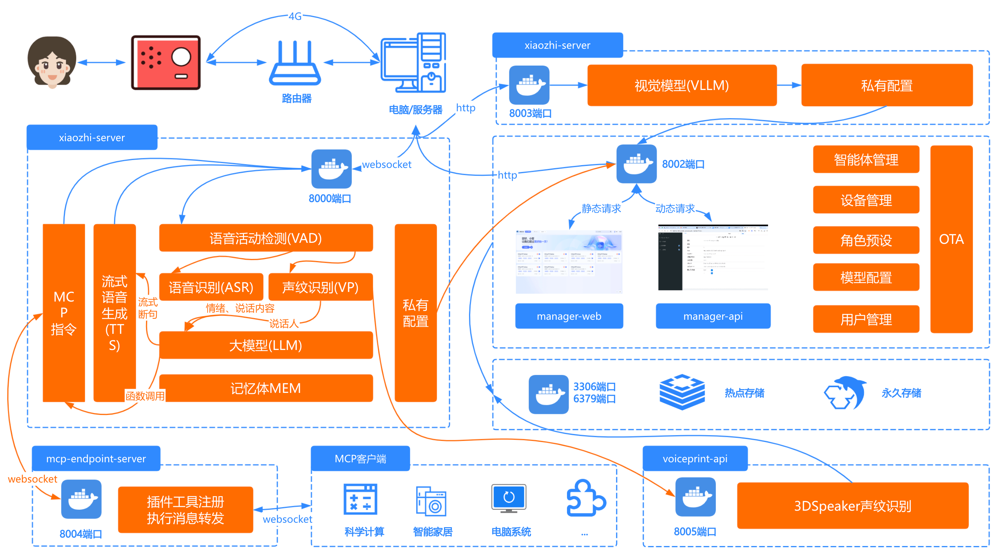

[](https://github.com/xinnan-tech/xiaozhi-esp32-server)

<h1 align="center">Xiaozhi Backend-Service xiaozhi-esp32-server</h1>

<p align="center">
Dieses Projekt basiert auf der Theorie und Technologie der Mensch-Maschine-symbiotischen Intelligenz zur Entwicklung intelligenter Terminal-Hardware- und Software-Systeme<br/>und bietet Backend-Dienste für das Open-Source-Hardware-Projekt
<a href="https://github.com/78/xiaozhi-esp32">xiaozhi-esp32</a><br/>
Implementiert mit Python, Java und Vue gemäß dem <a href="https://ccnphfhqs21z.feishu.cn/wiki/M0XiwldO9iJwHikpXD5cEx71nKh">Xiaozhi-Kommunikationsprotokoll</a><br/>
Unterstützt MQTT+UDP-Protokoll, Websocket-Protokoll, MCP-Endpunkte und Stimmabdruckerkennung
</p>

<p align="center">
<a href="./docs/FAQ.md">Häufige Fragen</a>
· <a href="https://github.com/xinnan-tech/xiaozhi-esp32-server/issues">Probleme melden</a>
· <a href="./README.md#%E9%83%A8%E7%BD%B2%E6%96%87%E6%A1%A3">Deployment-Dokumentation</a>
· <a href="https://github.com/xinnan-tech/xiaozhi-esp32-server/releases">Release-Hinweise</a>
</p>

<p align="center">
  <a href="./README.md"></a>
  <a href="./README_en.md"></a>
  <a href="./README_vi.md"></a>
  <a href="./README_de.md"></a>
  <a href="https://github.com/xinnan-tech/xiaozhi-esp32-server/releases">
    
  </a>
  <a href="https://github.com/xinnan-tech/xiaozhi-esp32-server/blob/main/LICENSE">
    
  </a>
  <a href="https://github.com/xinnan-tech/xiaozhi-esp32-server">
    
  </a>
</p>

<p align="center">
Geleitet vom Team von Professor Siyuan Liu (South China University of Technology)
</br>
刘思源教授团队主导研发(华南理工大学)
</br>

</p>

---

## Zielgruppe 👥

Dieses Projekt erfordert ESP32-Hardware-Geräte zum Betrieb. Wenn Sie ESP32-bezogene Hardware erworben haben, erfolgreich eine Verbindung zu Brother Xias bereitgestelltem Backend-Service hergestellt haben und Ihren eigenen `xiaozhi-esp32`-Backend-Service unabhängig aufbauen möchten, dann ist dieses Projekt perfekt für Sie.

Möchten Sie die Nutzungseffekte sehen? Klicken Sie auf die Videos unten 🎥

<table>
  <tr>
    <td>
        <a href="https://www.bilibili.com/video/BV1FMFyejExX" target="_blank">
         <picture>
           
         </picture>
        </a>
    </td>
    <td>
        <a href="https://www.bilibili.com/video/BV1vchQzaEse" target="_blank">
         <picture>
           
         </picture>
        </a>
    </td>
    <td>
        <a href="https://www.bilibili.com/video/BV1C1tCzUEZh" target="_blank">
         <picture>
           
         </picture>
        </a>
    </td>
    <td>
        <a href="https://www.bilibili.com/video/BV1zUW5zJEkq" target="_blank">
         <picture>
           
         </picture>
        </a>
    </td>
    <td>
        <a href="https://www.bilibili.com/video/BV1Exu3zqEDe" target="_blank">
         <picture>
           
         </picture>
        </a>
    </td>
  </tr>
  <tr>
    <td>
        <a href="https://www.bilibili.com/video/BV1pNXWYGEx1" target="_blank">
         <picture>
           
         </picture>
        </a>
    </td>
    <td>
        <a href="https://www.bilibili.com/video/BV1ZQKUzYExM" target="_blank">
         <picture>
           
         </picture>
        </a>
    </td>
    <td>
      <a href="https://www.bilibili.com/video/BV1TJ7WzzEo6" target="_blank">
         <picture>
           
         </picture>
        </a>
    </td>
    <td>
        <a href="https://www.bilibili.com/video/BV1VC96Y5EMH" target="_blank">
         <picture>
           
         </picture>
        </a>
    </td>
    <td>
        <a href="https://www.bilibili.com/video/BV1Z8XuYZEAS" target="_blank">
         <picture>
           
         </picture>
        </a>
    </td>
  </tr>
  <tr>
    <td>
      <a href="https://www.bilibili.com/video/BV12J7WzBEaH" target="_blank">
         <picture>
           
         </picture>
        </a>
    </td>
    <td>
      <a href="https://www.bilibili.com/video/BV1Co76z7EvK" target="_blank">
         <picture>
           
         </picture>
        </a>
    </td>
    <td>
        <a href="https://www.bilibili.com/video/BV1CDKWemEU6" target="_blank">
         <picture>
           
         </picture>
        </a>
    </td>
    <td>
        <a href="https://www.bilibili.com/video/BV12yA2egEaC" target="_blank">
         <picture>
           
         </picture>
        </a>
    </td>
    <td>
        <a href="https://www.bilibili.com/video/BV17LXWYvENb" target="_blank">
         <picture>
           
         </picture>
        </a>
    </td>
  </tr>
</table>

---

## Warnungen ⚠️

1. Dieses Projekt ist Open-Source-Software. Diese Software hat keine kommerzielle Partnerschaft mit Drittanbieter-API-Dienstleistern (einschließlich, aber nicht beschränkt auf Spracherkennung, große Modelle, Sprachsynthese und andere Plattformen), mit denen sie sich verbindet, und bietet keine Garantie für deren Servicequalität oder finanzielle Sicherheit. Es wird empfohlen, dass Benutzer Dienstleister mit entsprechenden Geschäftslizenzen bevorzugen und deren Servicevereinbarungen und Datenschutzrichtlinien sorgfältig lesen. Diese Software hostet keine Kontoschlüssel, nimmt nicht an Geldströmen teil und trägt nicht das Risiko von Verlusten bei Guthaben-Aufladungen.

2. Die Funktionalität dieses Projekts ist nicht vollständig und hat keine Netzwerksicherheitsbewertung bestanden. Bitte verwenden Sie es nicht in Produktionsumgebungen. Wenn Sie dieses Projekt zu Lernzwecken in einer öffentlichen Netzwerkumgebung bereitstellen, stellen Sie bitte sicher, dass notwendige Schutzmaßnahmen vorhanden sind.

---

## Deployment-Dokumentation


Dieses Projekt bietet zwei Bereitstellungsmethoden. Bitte wählen Sie basierend auf Ihren spezifischen Anforderungen:

#### 🚀 Auswahl der Bereitstellungsmethode
| Bereitstellungsmethode | Funktionen | Anwendungsszenarien | Deployment-Dokumente | Konfigurationsanforderungen | Video-Tutorials |
|---------|------|---------|---------|---------|---------|
| **Vereinfachte Installation** | Intelligenter Dialog, IOT, MCP, visuelle Wahrnehmung | Umgebungen mit geringer Konfiguration, Daten in Konfigurationsdateien gespeichert, keine Datenbank erforderlich | [①Docker-Version](./docs/Deployment.md#%E6%96%B9%E5%BC%8F%E4%B8%80docker%E5%8F%AA%E8%BF%90%E8%A1%8Cserver) / [②Quellcode-Deployment](./docs/Deployment.md#%E6%96%B9%E5%BC%8F%E4%BA%8C%E6%9C%AC%E5%9C%B0%E6%BA%90%E7%A0%81%E5%8F%AA%E8%BF%90%E8%A1%8Cserver)| 2 Kerne 4GB bei Verwendung von `FunASR`, 2 Kerne 2GB bei allen APIs | - |
| **Vollständige Modulinstallation** | Intelligenter Dialog, IOT, MCP-Endpunkte, Stimmabdruckerkennung, visuelle Wahrnehmung, OTA, intelligente Steuerkonsole | Vollständige Funktionserfahrung, Daten in Datenbank gespeichert |[①Docker-Version](./docs/Deployment_all.md#%E6%96%B9%E5%BC%8F%E4%B8%80docker%E8%BF%90%E8%A1%8C%E5%85%A8%E6%A8%A1%E5%9D%97) / [②Quellcode-Deployment](./docs/Deployment_all.md#%E6%96%B9%E5%BC%8F%E4%BA%8C%E6%9C%AC%E5%9C%B0%E6%BA%90%E7%A0%81%E8%BF%90%E8%A1%8C%E5%85%A8%E6%A8%A1%E5%9D%97) / [③Quellcode-Deployment Auto-Update-Tutorial](./docs/dev-ops-integration.md) | 4 Kerne 8GB bei Verwendung von `FunASR`, 2 Kerne 4GB bei allen APIs| [Video-Tutorial für lokalen Quellcode-Start](https://www.bilibili.com/video/BV1wBJhz4Ewe) |

Häufige Fragen und entsprechende Tutorials finden Sie unter [diesem Link](./docs/FAQ.md)

> 💡 Hinweis: Unten ist eine Testplattform, die mit dem neuesten Code bereitgestellt wurde. Sie können bei Bedarf brennen und testen. Gleichzeitige Benutzer: 6, Daten werden täglich gelöscht.

```
Adresse der intelligenten Steuerkonsole: https://2662r3426b.vicp.fun
Adresse der intelligenten Steuerkonsole (H5): https://2662r3426b.vicp.fun/h5/index.html

Service-Testtool: https://2662r3426b.vicp.fun/test/
OTA-Schnittstellenadresse: https://2662r3426b.vicp.fun/xiaozhi/ota/
Websocket-Schnittstellenadresse: wss://2662r3426b.vicp.fun/xiaozhi/v1/
```

#### 🚩 Konfigurationsbeschreibung und Empfehlungen
> [!Note]
> Dieses Projekt bietet zwei Konfigurationsschemata:
>
> 1. `Einstiegslevel Kostenlose Einstellungen`: Geeignet für den persönlichen und privaten Gebrauch, alle Komponenten verwenden kostenlose Lösungen, keine zusätzliche Zahlung erforderlich.
>
> 2. `Streaming-Konfiguration`: Geeignet für Demonstrationen, Schulungen, Szenarien mit mehr als 2 gleichzeitigen Benutzern usw. Verwendet Streaming-Verarbeitungstechnologie für schnellere Reaktionsgeschwindigkeit und bessere Erfahrung.
>
> Ab Version `0.5.2` unterstützt das Projekt Streaming-Konfiguration. Im Vergleich zu früheren Versionen ist die Reaktionsgeschwindigkeit um ca. `2,5 Sekunden` verbessert, was die Benutzererfahrung erheblich verbessert.

| Modulname | Einstiegslevel Kostenlose Einstellungen | Streaming-Konfiguration |
|:---:|:---:|:---:|
| ASR (Spracherkennung) | FunASR (Lokal) | 👍FunASR (Lokaler GPU-Modus) |
| LLM (Großes Modell) | ChatGLMLLM (Zhipu glm-4-flash) | 👍AliLLM (qwen3-235b-a22b-instruct-2507) oder 👍DoubaoLLM (doubao-1-5-pro-32k-250115) |
| VLLM (Vision Large Model) | ChatGLMVLLM (Zhipu glm-4v-flash) | 👍QwenVLVLLM (Qwen qwen2.5-vl-3b-instructh) |
| TTS (Sprachsynthese) | ✅LinkeraiTTS (Lingxi-Streaming) | 👍HuoshanDoubleStreamTTS (Volcano Dual-Stream-Sprachsynthese) oder 👍AliyunStreamTTS (Alibaba Cloud Streaming-Sprachsynthese) |
| Intent (Absichtserkennung) | function_call (Funktionsaufruf) | function_call (Funktionsaufruf) |
| Memory (Gedächtnisfunktion) | mem_local_short (Lokales Kurzzeitgedächtnis) | mem_local_short (Lokales Kurzzeitgedächtnis) |

Wenn Sie sich um die Latenz jeder Komponente kümmern, lesen Sie bitte den [Xiaozhi-Komponenten-Leistungstestbericht](https://github.com/xinnan-tech/xiaozhi-performance-research). Sie können gemäß den Testmethoden im Bericht in Ihrer Umgebung tatsächlich testen.

#### 🔧 Testwerkzeuge
Dieses Projekt bietet die folgenden Testwerkzeuge, um Ihnen bei der Überprüfung des Systems und der Auswahl geeigneter Modelle zu helfen:

| Werkzeugname | Standort | Verwendungsmethode | Funktionsbeschreibung |
|:---:|:---|:---:|:---:|
| Audio-Interaktionstesttool | main》xiaozhi-server》test》test_page.html | Direkt mit Google Chrome öffnen | Testet Audio-Wiedergabe- und Empfangsfunktionen, überprüft, ob die Python-seitige Audioverarbeitung normal ist |
| Modell-Reaktionstesttool | main》xiaozhi-server》performance_tester.py | Ausführen `python performance_tester.py` | Testet die Reaktionsgeschwindigkeit von ASR (Spracherkennung), LLM (großes Modell), VLLM (Vision-Modell), TTS (Sprachsynthese) drei Kernmodulen |

> 💡 Hinweis: Beim Testen der Modellgeschwindigkeit werden nur Modelle mit konfigurierten Schlüsseln getestet.

---
## Funktionsliste ✨
### Implementiert ✅

| Funktionsmodul | Beschreibung |
|:---:|:---|
| Kernarchitektur | Basierend auf [MQTT+UDP-Gateway](https://github.com/xinnan-tech/xiaozhi-esp32-server/blob/main/docs/mqtt-gateway-integration.md), WebSocket und HTTP-Servern, bietet vollständiges Konsolenverwaltungs- und Authentifizierungssystem |
| Sprachinteraktion | Unterstützt Streaming-ASR (Spracherkennung), Streaming-TTS (Sprachsynthese), VAD (Sprachaktivitätserkennung), unterstützt mehrsprachige Erkennung und Sprachverarbeitung |
| Stimmabdruckerkennung | Unterstützt Mehrbenutzer-Stimmabdruckregistrierung, -verwaltung und -erkennung, verarbeitet parallel mit ASR, Echtzeit-Sprecheridentitätserkennung und Weitergabe an LLM für personalisierte Antworten |
| Intelligenter Dialog | Unterstützt mehrere LLM (große Sprachmodelle), implementiert intelligenten Dialog |
| Visuelle Wahrnehmung | Unterstützt mehrere VLLM (Vision Large Models), implementiert multimodale Interaktion |
| Absichtserkennung | Unterstützt LLM-Absichtserkennung, Function Call-Funktionsaufruf, bietet plugin-basierten Absichtsverarbeitungsmechanismus |
| Gedächtnissystem | Unterstützt lokales Kurzzeitgedächtnis, mem0ai-Schnittstellengedächtnis, mit Gedächtniszusammenfassungsfunktion |
| Wissensdatenbank | Unterstützt RAGFlow-Wissensdatenbank, ermöglicht großem Modell die Bewertung, ob Wissensdatenbank benötigt wird, bevor geantwortet wird |
| Werkzeugaufruf | Unterstützt Client-IOT-Protokoll, Client-MCP-Protokoll, Server-MCP-Protokoll, MCP-Endpunktprotokoll, benutzerdefinierte Werkzeugfunktionen |
| Befehlsübermittlung | Basierend auf MQTT-Protokoll, unterstützt die Übermittlung von MCP-Befehlen von der intelligenten Steuerkonsole an ESP32-Geräte |
| Verwaltungs-Backend | Bietet Web-Verwaltungsoberfläche, unterstützt Benutzerverwaltung, Systemkonfiguration und Geräteverwaltung; Oberfläche unterstützt vereinfachtes Chinesisch, traditionelles Chinesisch und englische Anzeige |
| Testwerkzeuge | Bietet Leistungstestwerkzeuge, Vision-Modell-Testwerkzeuge und Audio-Interaktionstestwerkzeuge |
| Deployment-Unterstützung | Unterstützt Docker-Deployment und lokales Deployment, bietet vollständige Konfigurationsdateiverwaltung |
| Plugin-System | Unterstützt funktionale Plugin-Erweiterungen, benutzerdefinierte Plugin-Entwicklung und Plugin-Hot-Loading |

### In Entwicklung 🚧

Um über spezifische Entwicklungsplanfortschritte zu erfahren, [klicken Sie hier](https://github.com/users/xinnan-tech/projects/3). Häufige Fragen und entsprechende Tutorials finden Sie unter [diesem Link](./docs/FAQ.md)

Wenn Sie ein Softwareentwickler sind, finden Sie hier einen [Offenen Brief an Entwickler](docs/contributor_open_letter.md). Willkommen beim Beitritt!

---

## Produktökosystem 👬
Xiaozhi ist ein Ökosystem. Wenn Sie dieses Produkt verwenden, können Sie sich auch andere [hervorragende Projekte](https://github.com/78/xiaozhi-esp32?tab=readme-ov-file#%E7%9B%B8%E5%85%B3%E5%BC%80%E6%BA%90%E9%A1%B9%E7%9B%AE) in diesem Ökosystem ansehen

---

## Liste der von diesem Projekt unterstützten Plattformen/Komponenten 📋
### LLM-Sprachmodelle

| Verwendungsmethode | Unterstützte Plattformen | Kostenlose Plattformen |
|:---:|:---:|:---:|
| OpenAI-Schnittstellenaufrufe | Alibaba Bailian, Volcano Engine Doubao, DeepSeek, Zhipu ChatGLM, Gemini | Zhipu ChatGLM, Gemini |
| Ollama-Schnittstellenaufrufe | Ollama | - |
| Dify-Schnittstellenaufrufe | Dify | - |
| FastGPT-Schnittstellenaufrufe | FastGPT | - |
| Coze-Schnittstellenaufrufe | Coze | - |
| Xinference-Schnittstellenaufrufe | Xinference | - |
| HomeAssistant-Schnittstellenaufrufe | HomeAssistant | - |

Tatsächlich kann jedes LLM, das OpenAI-Schnittstellenaufrufe unterstützt, integriert und verwendet werden.

---

### VLLM-Vision-Modelle

| Verwendungsmethode | Unterstützte Plattformen | Kostenlose Plattformen |
|:---:|:---:|:---:|
| OpenAI-Schnittstellenaufrufe | Alibaba Bailian, Zhipu ChatGLMVLLM | Zhipu ChatGLMVLLM |

Tatsächlich kann jedes VLLM, das OpenAI-Schnittstellenaufrufe unterstützt, integriert und verwendet werden.

---

### TTS-Sprachsynthese

| Verwendungsmethode | Unterstützte Plattformen | Kostenlose Plattformen |
|:---:|:---:|:---:|
| Schnittstellenaufrufe | EdgeTTS, Volcano Engine Doubao TTS, Tencent Cloud, Alibaba Cloud TTS, AliYun Stream TTS, CosyVoiceSiliconflow, TTS302AI, CozeCnTTS, GizwitsTTS, ACGNTTS, OpenAITTS, Lingxi Streaming TTS, MinimaxTTS, Volcano Dual-Stream TTS | Lingxi Streaming TTS, EdgeTTS, CosyVoiceSiliconflow (teilweise) |
| Lokale Dienste | FishSpeech, GPT_SOVITS_V2, GPT_SOVITS_V3, Index-TTS, PaddleSpeech | Index-TTS, PaddleSpeech, FishSpeech, GPT_SOVITS_V2, GPT_SOVITS_V3 |

---

### VAD-Sprachaktivitätserkennung

| Typ | Plattformname | Verwendungsmethode | Preismodell | Hinweise |
|:---:|:---------:|:----:|:----:|:--:|
| VAD | SileroVAD | Lokale Verwendung | Kostenlos | |

---

### ASR-Spracherkennung

| Verwendungsmethode | Unterstützte Plattformen | Kostenlose Plattformen |
|:---:|:---:|:---:|
| Lokale Verwendung | FunASR, SherpaASR | FunASR, SherpaASR |
| Schnittstellenaufrufe | DoubaoASR, Doubao Streaming ASR, FunASRServer, TencentASR, AliyunASR, Aliyun Streaming ASR, Baidu ASR, OpenAI ASR | FunASRServer |

---

### Voiceprint-Stimmabdruckerkennung

| Verwendungsmethode | Unterstützte Plattformen | Kostenlose Plattformen |
|:---:|:---:|:---:|
| Lokale Verwendung | 3D-Speaker | 3D-Speaker |

---

### Memory-Gedächtnisspeicher

| Typ | Plattformname | Verwendungsmethode | Preismodell | Hinweise |
|:------:|:---------------:|:----:|:---------:|:--:|
| Memory | mem0ai | Schnittstellenaufrufe | 1000 Mal/Monat Kontingent | |
| Memory | mem_local_short | Lokale Zusammenfassung | Kostenlos | |
| Memory | nomem | Kein Gedächtnismodus | Kostenlos | |

---

### Intent-Absichtserkennung

| Typ | Plattformname | Verwendungsmethode | Preismodell | Hinweise |
|:------:|:-------------:|:----:|:-------:|:---------------------:|
| Intent | intent_llm | Schnittstellenaufrufe | Basierend auf LLM-Preisen | Erkennt Absicht durch große Modelle, starke Allgemeingültigkeit |
| Intent | function_call | Schnittstellenaufrufe | Basierend auf LLM-Preisen | Vervollständigt Absicht durch Funktionsaufruf großer Modelle, schnelle Geschwindigkeit, guter Effekt |
| Intent | nointent | Kein Absichtsmodus | Kostenlos | Führt keine Absichtserkennung durch, gibt direkt Dialogergebnis zurück |

---

### Rag Retrieval Augmented Generation

| Typ | Plattformname | Verwendungsmethode | Preismodell | Hinweise |
|:------:|:-------------:|:----:|:-------:|:---------------------:|
| Rag | ragflow | Schnittstellenaufrufe | Gebühren basierend auf Token-Verbrauch für Segmentierung und Tokenisierung | Nutzt RAGFlow's Retrieval-Augmented-Generation-Funktion für präzisere Dialogantworten |

---

## Danksagungen 🙏

| Logo | Projekt/Unternehmen | Beschreibung |
|:---:|:---:|:---|
|  | [Bailing Voice Dialogue Robot](https://github.com/wwbin2017/bailing) | Dieses Projekt wurde von [Bailing Voice Dialogue Robot](https://github.com/wwbin2017/bailing) inspiriert und auf dessen Basis implementiert |
|  | [Tenclass](https://www.tenclass.com/) | Dank an [Tenclass](https://www.tenclass.com/) für die Formulierung von Standardkommunikationsprotokollen, Multi-Geräte-Kompatibilitätslösungen und High-Concurrency-Szenario-Praxisdemonstrationen für das Xiaozhi-Ökosystem; für die Bereitstellung vollständiger technischer Dokumentationsunterstützung für dieses Projekt |
|  | [Xuanfeng Technology](https://github.com/Eric0308) | Dank an [Xuanfeng Technology](https://github.com/Eric0308) für den Beitrag des Funktionsaufruf-Frameworks, des MCP-Kommunikationsprotokolls und der plugin-basierten Aufrufmechanismus-Implementierungscode. Durch standardisiertes Befehlsplanungssystem und dynamische Erweiterungsfähigkeiten wird die Interaktionseffizienz und funktionale Erweiterbarkeit von Frontend-Geräten (IoT) erheblich verbessert |
|  | [huangjunsen](https://github.com/huangjunsen0406) | Dank an [huangjunsen](https://github.com/huangjunsen0406) für den Beitrag des `Smart Control Console Mobile`-Moduls, das eine effiziente Steuerung und Echtzeit-Interaktion über mobile Geräte ermöglicht und die Betriebsbequemlichkeit und Verwaltungseffizienz des Systems in mobilen Szenarien erheblich verbessert |
|  | [Huiyuan Design](http://ui.kwd988.net/) | Dank an [Huiyuan Design](http://ui.kwd988.net/) für die Bereitstellung professioneller visueller Lösungen für dieses Projekt, unter Verwendung ihrer Design-Praxiserfahrung im Dienst von über tausend Unternehmen, um die Produktbenutzererfahrung dieses Projekts zu stärken |
|  | [Xi'an Qinren Information Technology](https://www.029app.com/) | Dank an [Xi'an Qinren Information Technology](https://www.029app.com/) für die Vertiefung des visuellen Systems dieses Projekts und die Sicherstellung der Konsistenz und Erweiterbarkeit des Gesamtdesignstils in Multi-Szenario-Anwendungen |
|  | [Code-Mitwirkende](https://github.com/xinnan-tech/xiaozhi-esp32-server/graphs/contributors) | Dank an [alle Code-Mitwirkenden](https://github.com/xinnan-tech/xiaozhi-esp32-server/graphs/contributors), Ihre Bemühungen haben das Projekt robuster und leistungsfähiger gemacht. |


<a href="https://star-history.com/#xinnan-tech/xiaozhi-esp32-server&Date">

 <picture>
   <source media="(prefers-color-scheme: dark)" srcset="https://api.star-history.com/svg?repos=xinnan-tech/xiaozhi-esp32-server&type=Date&theme=dark" />
   <source media="(prefers-color-scheme: light)" srcset="https://api.star-history.com/svg?repos=xinnan-tech/xiaozhi-esp32-server&type=Date" />
   
 </picture>
</a>
