[](https://github.com/xinnan-tech/xiaozhi-esp32-server)

<h1 align="center">Dịch vụ Backend Xiaozhi xiaozhi-esp32-server</h1>

<p align="center">
Dự án này dựa trên lý thuyết và công nghệ trí tuệ cộng sinh người-máy để phát triển hệ thống phần mềm và phần cứng thiết bị đầu cuối thông minh<br/>Cung cấp dịch vụ backend cho dự án phần cứng thông minh mã nguồn mở
<a href="https://github.com/78/xiaozhi-esp32">xiaozhi-esp32</a><br/>
Được triển khai bằng Python, Java, Vue theo <a href="https://ccnphfhqs21z.feishu.cn/wiki/M0XiwldO9iJwHikpXD5cEx71nKh">giao thức truyền thông Xiaozhi</a><br/>
Hỗ trợ giao thức MQTT+UDP, giao thức Websocket, điểm truy cập MCP, nhận dạng giọng nói và kho tri thức
</p>

<p align="center">
<a href="./docs/FAQ.md">Câu hỏi thường gặp</a>
· <a href="https://github.com/xinnan-tech/xiaozhi-esp32-server/issues">Báo cáo vấn đề</a>
· <a href="./README.md#%E9%83%A8%E7%BD%B2%E6%96%87%E6%A1%A3">Tài liệu triển khai</a>
· <a href="https://github.com/xinnan-tech/xiaozhi-esp32-server/releases">Nhật ký cập nhật</a>
</p>

<p align="center">
  <a href="./README.md"></a>
  <a href="./README_en.md"></a>
  <a href="./README_vi.md"></a>
  <a href="./README_de.md"></a>
  <a href="https://github.com/xinnan-tech/xiaozhi-esp32-server/releases">
    
  </a>
  <a href="https://github.com/xinnan-tech/xiaozhi-esp32-server/blob/main/LICENSE">
    
  </a>
  <a href="https://github.com/xinnan-tech/xiaozhi-esp32-server">
    
  </a>
</p>

<p align="center">
Spearheaded by Professor Siyuan Liu's Team (South China University of Technology)
</br>
Được dẫn dắt bởi nhóm Giáo sư Lưu Tư Nguyên (Đại học Bách khoa Nam Trung Quốc)
</br>
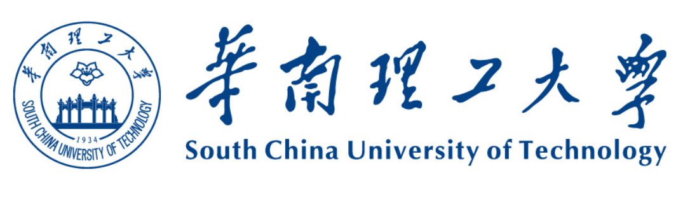
</p>

---

## Người dùng phù hợp 👥

Dự án này cần được sử dụng cùng với thiết bị phần cứng ESP32. Nếu bạn đã mua phần cứng liên quan đến ESP32, đã thành công kết nối với dịch vụ backend do anh Xia triển khai, và muốn xây dựng dịch vụ backend `xiaozhi-esp32` riêng của mình, thì dự án này rất phù hợp với bạn.

Muốn xem hiệu quả sử dụng? Hãy xem video 🎥

<table>
  <tr>
    <td>
        <a href="https://www.bilibili.com/video/BV1FMFyejExX" target="_blank">
         <picture>
           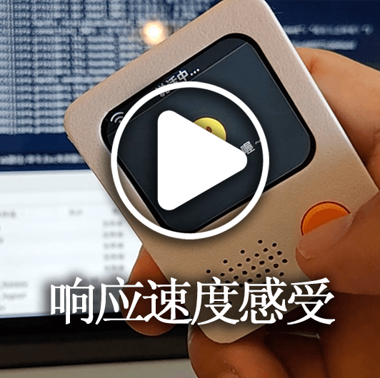
         </picture>
        </a>
    </td>
    <td>
        <a href="https://www.bilibili.com/video/BV1vchQzaEse" target="_blank">
         <picture>
           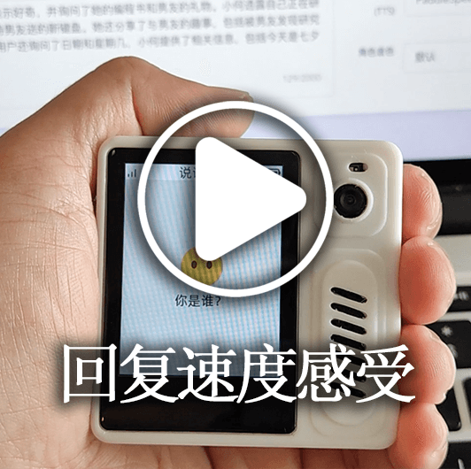
         </picture>
        </a>
    </td>
    <td>
        <a href="https://www.bilibili.com/video/BV1C1tCzUEZh" target="_blank">
         <picture>
           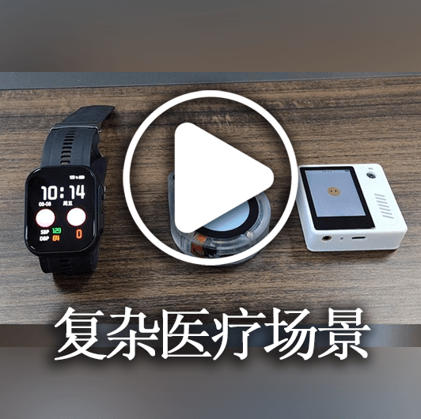
         </picture>
        </a>
    </td>
    <td>
        <a href="https://www.bilibili.com/video/BV1zUW5zJEkq" target="_blank">
         <picture>
           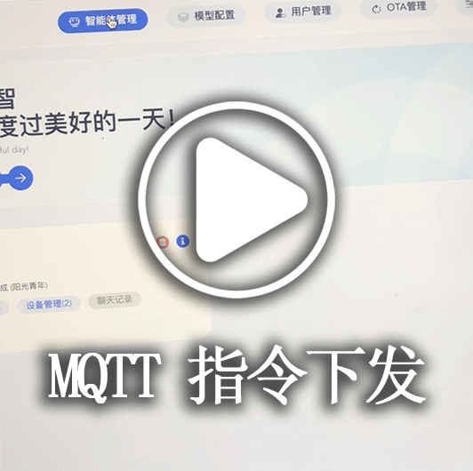
         </picture>
        </a>
    </td>
    <td>
        <a href="https://www.bilibili.com/video/BV1Exu3zqEDe" target="_blank">
         <picture>
           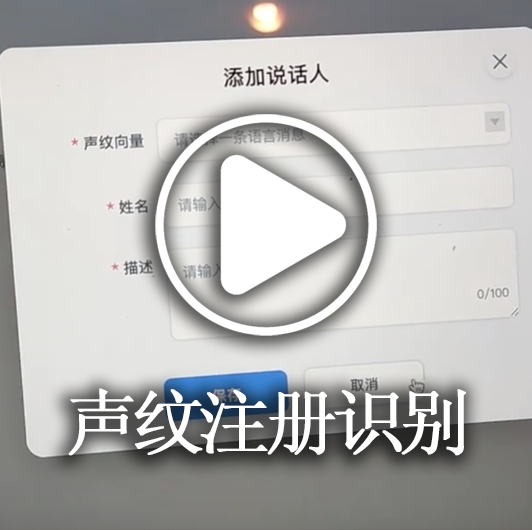
         </picture>
        </a>
    </td>
  </tr>
  <tr>
    <td>
        <a href="https://www.bilibili.com/video/BV1pNXWYGEx1" target="_blank">
         <picture>
           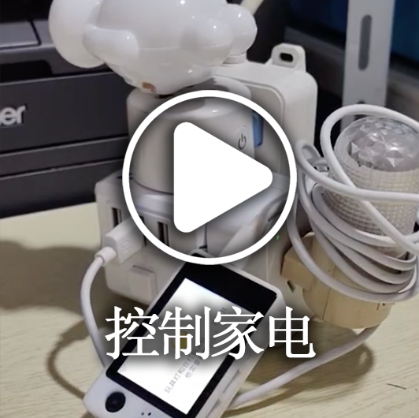
         </picture>
        </a>
    </td>
    <td>
        <a href="https://www.bilibili.com/video/BV1ZQKUzYExM" target="_blank">
         <picture>
           
         </picture>
        </a>
    </td>
    <td>
      <a href="https://www.bilibili.com/video/BV1TJ7WzzEo6" target="_blank">
         <picture>
           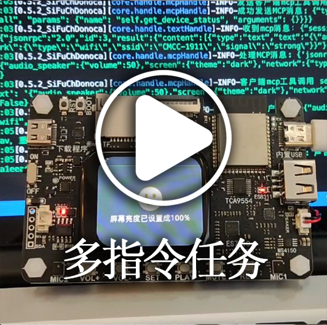
         </picture>
        </a>
    </td>
    <td>
        <a href="https://www.bilibili.com/video/BV1VC96Y5EMH" target="_blank">
         <picture>
           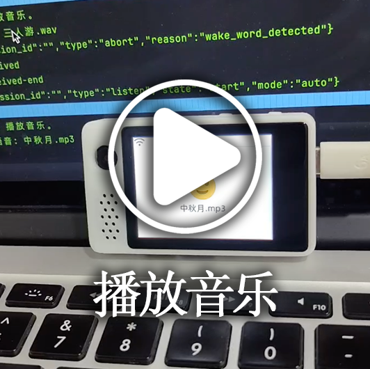
         </picture>
        </a>
    </td>
    <td>
        <a href="https://www.bilibili.com/video/BV1Z8XuYZEAS" target="_blank">
         <picture>
           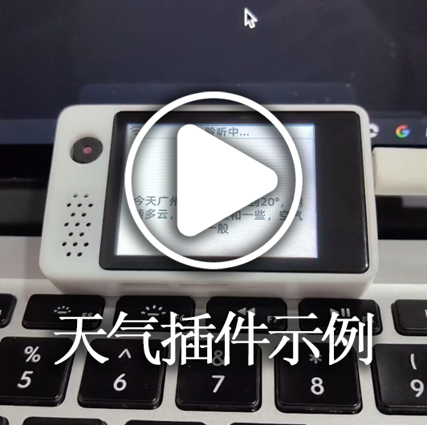
         </picture>
        </a>
    </td>
  </tr>
  <tr>
    <td>
      <a href="https://www.bilibili.com/video/BV12J7WzBEaH" target="_blank">
         <picture>
           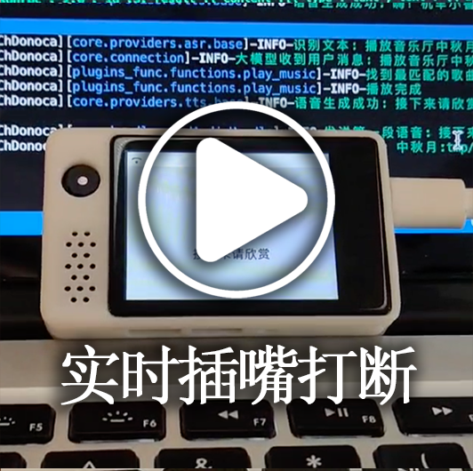
         </picture>
        </a>
    </td>
    <td>
      <a href="https://www.bilibili.com/video/BV1Co76z7EvK" target="_blank">
         <picture>
           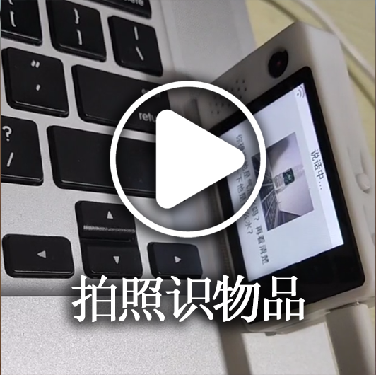
         </picture>
        </a>
    </td>
    <td>
        <a href="https://www.bilibili.com/video/BV1CDKWemEU6" target="_blank">
         <picture>
           
         </picture>
        </a>
    </td>
    <td>
        <a href="https://www.bilibili.com/video/BV12yA2egEaC" target="_blank">
         <picture>
           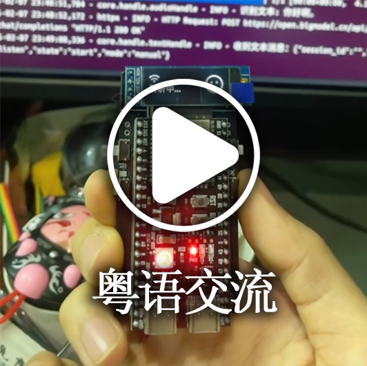
         </picture>
        </a>
    </td>
    <td>
        <a href="https://www.bilibili.com/video/BV17LXWYvENb" target="_blank">
         <picture>
           
         </picture>
        </a>
    </td>
  </tr>
</table>

---

## Cảnh báo ⚠️

1. Dự án này là phần mềm mã nguồn mở, phần mềm này không có quan hệ hợp tác thương mại với bất kỳ nhà cung cấp dịch vụ API bên thứ ba nào (bao gồm nhưng không giới hạn ở các nền tảng nhận dạng giọng nói, mô hình lớn, tổng hợp giọng nói, v.v.), và không đảm bảo chất lượng dịch vụ cũng như an toàn tài chính của họ.
Khuyến nghị người dùng ưu tiên lựa chọn nhà cung cấp dịch vụ có giấy phép kinh doanh liên quan và đọc kỹ thỏa thuận dịch vụ và chính sách bảo mật của họ. Phần mềm này không lưu trữ bất kỳ khóa tài khoản nào, không tham gia vào luồng tiền và không chịu rủi ro mất tiền nạp.

2. Chức năng của dự án này chưa hoàn thiện và chưa qua đánh giá bảo mật mạng, vui lòng không sử dụng trong môi trường sản xuất. Nếu bạn triển khai dự án này trong môi trường mạng công cộng để học tập, vui lòng thực hiện các biện pháp bảo vệ cần thiết.

---

## Tài liệu triển khai


Dự án này cung cấp hai phương pháp triển khai, vui lòng chọn theo nhu cầu cụ thể của bạn:

#### 🚀 Lựa chọn phương pháp triển khai
| Phương pháp triển khai | Đặc điểm | Tình huống áp dụng | Tài liệu triển khai | Yêu cầu cấu hình | Video hướng dẫn |
|---------|------|---------|---------|---------|---------|
| **Cài đặt tối giản** | Đối thoại thông minh, IOT, MCP, cảm nhận thị giác | Môi trường cấu hình thấp, dữ liệu lưu trong tệp cấu hình, không cần cơ sở dữ liệu | [①Phiên bản Docker](./docs/Deployment.md#%E6%96%B9%E5%BC%8F%E4%B8%80docker%E5%8F%AA%E8%BF%90%E8%A1%8Cserver) / [②Triển khai mã nguồn](./docs/Deployment.md#%E6%96%B9%E5%BC%8F%E4%BA%8C%E6%9C%AC%E5%9C%B0%E6%BA%90%E7%A0%81%E5%8F%AA%E8%BF%90%E8%A1%8Cserver)| 2 nhân 4GB nếu dùng `FunASR`, 2 nhân 2GB nếu toàn API | - |
| **Cài đặt toàn bộ module** | Đối thoại thông minh, IOT, điểm truy cập MCP, nhận dạng giọng nói, cảm nhận thị giác, OTA, bảng điều khiển thông minh | Trải nghiệm đầy đủ tính năng, dữ liệu lưu trong cơ sở dữ liệu |[①Phiên bản Docker](./docs/Deployment_all.md#%E6%96%B9%E5%BC%8F%E4%B8%80docker%E8%BF%90%E8%A1%8C%E5%85%A8%E6%A8%A1%E5%9D%97) / [②Triển khai mã nguồn](./docs/Deployment_all.md#%E6%96%B9%E5%BC%8F%E4%BA%8C%E6%9C%AC%E5%9C%B0%E6%BA%90%E7%A0%81%E8%BF%90%E8%A1%8C%E5%85%A8%E6%A8%A1%E5%9D%97) / [③Hướng dẫn tự động cập nhật triển khai mã nguồn](./docs/dev-ops-integration.md) | 4 nhân 8GB nếu dùng `FunASR`, 2 nhân 4GB nếu toàn API| [Video hướng dẫn khởi động mã nguồn cục bộ](https://www.bilibili.com/video/BV1wBJhz4Ewe) |

Câu hỏi thường gặp và hướng dẫn liên quan, vui lòng tham khảo [liên kết này](./docs/FAQ.md)

> 💡 Gợi ý: Dưới đây là nền tảng thử nghiệm được triển khai theo mã mới nhất, có thể flash để thử nghiệm nếu cần, đồng thời là 6, dữ liệu sẽ được xóa mỗi ngày,

```
Địa chỉ bảng điều khiển thông minh: https://2662r3426b.vicp.fun
Bảng điều khiển thông minh (phiên bản h5): https://2662r3426b.vicp.fun/h5/index.html

Công cụ kiểm tra dịch vụ: https://2662r3426b.vicp.fun/test/
Địa chỉ giao diện OTA: https://2662r3426b.vicp.fun/xiaozhi/ota/
Địa chỉ giao diện Websocket: wss://2662r3426b.vicp.fun/xiaozhi/v1/
```

#### 🚩 Mô tả và khuyến nghị cấu hình
> [!Note]
> Dự án này cung cấp hai phương án cấu hình:
>
> 1. Cấu hình `Miễn phí hoàn toàn cho người mới`: Phù hợp với sử dụng gia đình cá nhân, tất cả các thành phần đều sử dụng phương án miễn phí, không cần thanh toán thêm.
>
> 2. `Cấu hình streaming`: Phù hợp với demo, đào tạo, hơn 2 đồng thời, v.v., sử dụng công nghệ xử lý streaming, tốc độ phản hồi nhanh hơn, trải nghiệm tốt hơn.
>
> Từ phiên bản `0.5.2`, dự án hỗ trợ cấu hình streaming, so với phiên bản đầu, tốc độ phản hồi cải thiện khoảng `2.5 giây`, cải thiện đáng kể trải nghiệm người dùng.

| Tên module | Cài đặt miễn phí cho người mới | Cấu hình streaming |
|:---:|:---:|:---:|
| ASR(Nhận dạng giọng nói) | FunASR(Local) | 👍FunASR(Chế độ GPU cục bộ) |
| LLM(Mô hình lớn) | ChatGLMLLM(Zhipu glm-4-flash) | 👍AliLLM(qwen3-235b-a22b-instruct-2507) hoặc 👍DoubaoLLM(doubao-1-5-pro-32k-250115) |
| VLLM(Mô hình lớn thị giác) | ChatGLMVLLM(Zhipu glm-4v-flash) | 👍QwenVLVLLM(Qwen qwen2.5-vl-3b-instructh) |
| TTS(Tổng hợp giọng nói) | ✅LinkeraiTTS(Lingxi streaming) | 👍HuoshanDoubleStreamTTS(Tổng hợp giọng nói streaming kép Volcano) hoặc 👍AliyunStreamTTS(Tổng hợp giọng nói streaming Alibaba Cloud) |
| Intent(Nhận dạng ý định) | function_call(Gọi hàm) | function_call(Gọi hàm) |
| Memory(Chức năng bộ nhớ) | mem_local_short(Bộ nhớ ngắn hạn cục bộ) | mem_local_short(Bộ nhớ ngắn hạn cục bộ) |

Nếu bạn quan tâm đến thời gian của từng thành phần, vui lòng xem [Báo cáo kiểm tra hiệu suất các thành phần Xiaozhi](https://github.com/xinnan-tech/xiaozhi-performance-research), có thể kiểm tra thực tế trong môi trường của bạn theo phương pháp kiểm tra trong báo cáo.

#### 🔧 Công cụ kiểm tra
Dự án này cung cấp các công cụ kiểm tra sau để giúp bạn xác minh hệ thống và chọn mô hình phù hợp:

| Tên công cụ | Vị trí | Phương pháp sử dụng | Mô tả chức năng |
|:---:|:---|:---:|:---:|
| Công cụ kiểm tra tương tác âm thanh | main》xiaozhi-server》test》test_page.html | Mở trực tiếp bằng trình duyệt Google Chrome | Kiểm tra chức năng phát và nhận âm thanh, xác minh xử lý âm thanh phía Python có bình thường không |
| Công cụ kiểm tra phản hồi mô hình | main》xiaozhi-server》performance_tester.py | Thực hiện `python performance_tester.py` | Kiểm tra tốc độ phản hồi của ba module cốt lõi ASR(Nhận dạng giọng nói), LLM(Mô hình lớn), VLLM(Mô hình thị giác), TTS(Tổng hợp giọng nói) |

> 💡 Gợi ý: Khi kiểm tra tốc độ mô hình, chỉ kiểm tra các mô hình đã cấu hình khóa.

---
## Danh sách tính năng ✨
### Đã thực hiện ✅

| Module chức năng | Mô tả |
|:---:|:---|
| Kiến trúc cốt lõi | Dựa trên [cổng MQTT+UDP](https://github.com/xinnan-tech/xiaozhi-esp32-server/blob/main/docs/mqtt-gateway-integration.md), WebSocket, máy chủ HTTP, cung cấp hệ thống quản lý bảng điều khiển và xác thực hoàn chỉnh |
| Tương tác giọng nói | Hỗ trợ ASR streaming(Nhận dạng giọng nói), TTS streaming(Tổng hợp giọng nói), VAD(Phát hiện hoạt động giọng nói), hỗ trợ nhận dạng đa ngôn ngữ và xử lý giọng nói |
| Nhận dạng vân giọng | Hỗ trợ đăng ký, quản lý và nhận dạng vân giọng đa người dùng, xử lý song song với ASR, nhận dạng danh tính người nói theo thời gian thực và truyền cho LLM để phản hồi cá nhân hóa |
| Đối thoại thông minh | Hỗ trợ nhiều LLM(Mô hình ngôn ngữ lớn), thực hiện đối thoại thông minh |
| Cảm nhận thị giác | Hỗ trợ nhiều VLLM(Mô hình lớn thị giác), thực hiện tương tác đa phương thức |
| Nhận dạng ý định | Hỗ trợ nhận dạng ý định mô hình lớn gắn ngoài, gọi hàm tự chủ mô hình lớn, cung cấp cơ chế xử lý ý định dạng plugin |
| Hệ thống bộ nhớ | Hỗ trợ bộ nhớ ngắn hạn cục bộ, bộ nhớ giao diện mem0ai, có chức năng tóm tắt bộ nhớ |
| Kho tri thức | Hỗ trợ kho tri thức RAGFlow, cho phép mô hình lớn đánh giá cần gọi kho tri thức trước khi trả lời |
| Gọi công cụ | Hỗ trợ giao thức IOT phía client, giao thức MCP phía client, giao thức MCP phía server, giao thức điểm truy cập MCP, hàm công cụ tùy chỉnh |
| Gửi lệnh | Dựa vào giao thức MQTT, hỗ trợ gửi lệnh MCP từ bảng điều khiển thông minh xuống thiết bị ESP32 |
| Backend quản lý | Cung cấp giao diện quản lý Web, hỗ trợ quản lý người dùng, cấu hình hệ thống và quản lý thiết bị; giao diện hỗ trợ hiển thị tiếng Trung giản thể, tiếng Trung phồn thể, tiếng Anh |
| Công cụ kiểm tra | Cung cấp công cụ kiểm tra hiệu suất, công cụ kiểm tra mô hình thị giác và công cụ kiểm tra tương tác âm thanh |
| Hỗ trợ triển khai | Hỗ trợ triển khai Docker và triển khai cục bộ, cung cấp quản lý tệp cấu hình hoàn chỉnh |
| Hệ thống plugin | Hỗ trợ mở rộng plugin chức năng, phát triển plugin tùy chỉnh và hot loading plugin |

### Đang phát triển 🚧

Muốn hiểu tiến độ kế hoạch phát triển cụ thể, [vui lòng nhấp vào đây](https://github.com/users/xinnan-tech/projects/3). Câu hỏi thường gặp và hướng dẫn liên quan, vui lòng tham khảo [liên kết này](./docs/FAQ.md)

Nếu bạn là một nhà phát triển phần mềm, đây có một [Lá thư mở gửi các nhà phát triển](docs/contributor_open_letter.md), chào mừng tham gia!

---

## Hệ sinh thái sản phẩm 👬
Xiaozhi là một hệ sinh thái, khi bạn sử dụng sản phẩm này, bạn cũng có thể xem các [dự án xuất sắc](https://github.com/78/xiaozhi-esp32?tab=readme-ov-file#%E7%9B%B8%E5%85%B3%E5%BC%80%E6%BA%90%E9%A1%B9%E7%9B%AE) khác trong hệ sinh thái này

---

## Danh sách nền tảng/thành phần được dự án này hỗ trợ 📋
### LLM Mô hình ngôn ngữ

| Phương pháp sử dụng | Nền tảng hỗ trợ | Nền tảng miễn phí |
|:---:|:---:|:---:|
| Gọi giao diện openai | Alibaba Bailian, Volcano Engine, DeepSeek, Zhipu, Gemini, iFlytek | Zhipu, Gemini |
| Gọi giao diện ollama | Ollama | - |
| Gọi giao diện dify | Dify | - |
| Gọi giao diện fastgpt | Fastgpt | - |
| Gọi giao diện coze | Coze | - |
| Gọi giao diện xinference | Xinference | - |
| Gọi giao diện homeassistant | HomeAssistant | - |

Trên thực tế, bất kỳ LLM nào hỗ trợ gọi giao diện openai đều có thể truy cập sử dụng.

---

### VLLM Mô hình thị giác

| Phương pháp sử dụng | Nền tảng hỗ trợ | Nền tảng miễn phí |
|:---:|:---:|:---:|
| Gọi giao diện openai | Alibaba Bailian, Zhipu ChatGLMVLLM | Zhipu ChatGLMVLLM |

Trên thực tế, bất kỳ VLLM nào hỗ trợ gọi giao diện openai đều có thể truy cập sử dụng.

---

### TTS Tổng hợp giọng nói

| Phương pháp sử dụng | Nền tảng hỗ trợ | Nền tảng miễn phí |
|:---:|:---:|:---:|
| Gọi giao diện | EdgeTTS, iFlytek, Volcano Engine, Tencent Cloud, Alibaba Cloud và Bailian, CosyVoiceSiliconflow, TTS302AI, CozeCnTTS, GizwitsTTS, ACGNTTS, OpenAITTS, Lingxi streaming TTS, MinimaxTTS | Lingxi streaming TTS, EdgeTTS, CosyVoiceSiliconflow(một phần) |
| Dịch vụ cục bộ | FishSpeech, GPT_SOVITS_V2, GPT_SOVITS_V3, Index-TTS, PaddleSpeech | Index-TTS, PaddleSpeech, FishSpeech, GPT_SOVITS_V2, GPT_SOVITS_V3 |

---

### VAD Phát hiện hoạt động giọng nói

| Loại  |   Tên nền tảng    | Phương pháp sử dụng | Mô hình thu phí | Ghi chú |
|:---:|:---------:|:----:|:----:|:--:|
| VAD | SileroVAD | Sử dụng cục bộ |  Miễn phí  |    |

---

### ASR Nhận dạng giọng nói

| Phương pháp sử dụng | Nền tảng hỗ trợ | Nền tảng miễn phí |
|:---:|:---:|:---:|
| Sử dụng cục bộ | FunASR, SherpaASR | FunASR, SherpaASR |
| Gọi giao diện | FunASRServer, Volcano Engine, iFlytek, Tencent Cloud, Alibaba Cloud, Baidu Cloud, OpenAI ASR | FunASRServer |

---

### Voiceprint Nhận dạng vân giọng

| Phương pháp sử dụng | Nền tảng hỗ trợ | Nền tảng miễn phí |
|:---:|:---:|:---:|
| Sử dụng cục bộ | 3D-Speaker | 3D-Speaker |

---

### Memory Lưu trữ bộ nhớ

|   Loại   |      Tên nền tảng       | Phương pháp sử dụng |   Mô hình thu phí    | Ghi chú |
|:------:|:---------------:|:----:|:---------:|:--:|
| Memory |     mem0ai      | Gọi giao diện | Hạn mức 1000 lần/tháng |    |
| Memory | mem_local_short | Tóm tắt cục bộ |    Miễn phí     |    |
| Memory |     nomem       | Chế độ không có bộ nhớ |    Miễn phí     |    |

---

### Intent Nhận dạng ý định

|   Loại   |     Tên nền tảng      | Phương pháp sử dụng |  Mô hình thu phí   |          Ghi chú           |
|:------:|:-------------:|:----:|:-------:|:---------------------:|
| Intent |  intent_llm   | Gọi giao diện | Thu phí theo LLM |    Nhận dạng ý định qua mô hình lớn, tính tổng quát mạnh     |
| Intent | function_call | Gọi giao diện | Thu phí theo LLM | Hoàn thành ý định qua gọi hàm mô hình lớn, tốc độ nhanh, hiệu quả tốt |
| Intent |    nointent   | Chế độ không có ý định |    Miễn phí     |    Không thực hiện nhận dạng ý định, trả về trực tiếp kết quả đối thoại     |

---

### Rag Tăng cường truy xuất thông tin

|   Loại   |     Tên nền tảng      | Phương pháp sử dụng |  Mô hình thu phí   |          Ghi chú           |
|:------:|:-------------:|:----:|:-------:|:---------------------:|
| Rag |  ragflow   | Gọi giao diện | Thu phí theo token tiêu tốn của phân đoạn, phân từ |    Sử dụng chức năng tăng cường truy xuất của RagFlow, cung cấp phản hồi đối thoại chính xác hơn     |

---

## Lời cảm ơn 🙏

| Logo | Dự án/Công ty | Mô tả |
|:---:|:---:|:---|
|  | [Robot đối thoại giọng nói Bailing](https://github.com/wwbin2017/bailing) | Dự án này được lấy cảm hứng từ [Robot đối thoại giọng nói Bailing](https://github.com/wwbin2017/bailing) và được triển khai trên cơ sở đó |
|  | [Shifang Ronghai](https://www.tenclass.com/) | Cảm ơn [Shifang Ronghai](https://www.tenclass.com/) đã xây dựng giao thức truyền thông tiêu chuẩn, phương án tương thích đa thiết bị và mô phạm thực hành tình huống đồng thời cao cho hệ sinh thái Xiaozhi; cung cấp tài liệu hỗ trợ kỹ thuật toàn diện cho dự án này |
|  | [Xuanfeng Technology](https://github.com/Eric0308) | Cảm ơn [Xuanfeng Technology](https://github.com/Eric0308) đã đóng góp khung gọi hàm, giao thức truyền thông MCP và mã triển khai cơ chế gọi dạng plugin, thông qua hệ thống điều phối lệnh tiêu chuẩn hóa và khả năng mở rộng động, đã cải thiện đáng kể hiệu suất tương tác và khả năng mở rộng chức năng của thiết bị front-end(IoT) |
|  | [huangjunsen](https://github.com/huangjunsen0406) | Cảm ơn [huangjunsen](https://github.com/huangjunsen0406) đã đóng góp module `Bảng điều khiển thông minh di động`, thực hiện điều khiển hiệu quả và tương tác thời gian thực trên thiết bị di động đa nền tảng, cải thiện đáng kể sự tiện lợi vận hành và hiệu quả quản lý của hệ thống trong tình huống di động |
|  | [Huiyuan Design](http://ui.kwd988.net/) | Cảm ơn [Huiyuan Design](http://ui.kwd988.net/) đã cung cấp giải pháp thị giác chuyên nghiệp cho dự án này, sử dụng kinh nghiệm thực tế thiết kế phục vụ hơn nghìn doanh nghiệp, trao quyền cho trải nghiệm người dùng sản phẩm của dự án này |
|  | [Xi'an Qinren Information Technology](https://www.029app.com/) | Cảm ơn [Xi'an Qinren Information Technology](https://www.029app.com/) đã làm sâu sắc hệ thống thị giác của dự án này, đảm bảo tính nhất quán và khả năng mở rộng của phong cách thiết kế tổng thể trong ứng dụng đa tình huống |
|  | [Người đóng góp mã](https://github.com/xinnan-tech/xiaozhi-esp32-server/graphs/contributors) | Cảm ơn [tất cả người đóng góp mã](https://github.com/xinnan-tech/xiaozhi-esp32-server/graphs/contributors), sự cống hiến của bạn khiến dự án mạnh mẽ và vững chắc hơn. |


<a href="https://star-history.com/#xinnan-tech/xiaozhi-esp32-server&Date">

 <picture>
   <source media="(prefers-color-scheme: dark)" srcset="https://api.star-history.com/svg?repos=xinnan-tech/xiaozhi-esp32-server&type=Date&theme=dark" />
   <source media="(prefers-color-scheme: light)" srcset="https://api.star-history.com/svg?repos=xinnan-tech/xiaozhi-esp32-server&type=Date" />
   
 </picture>
</a>
