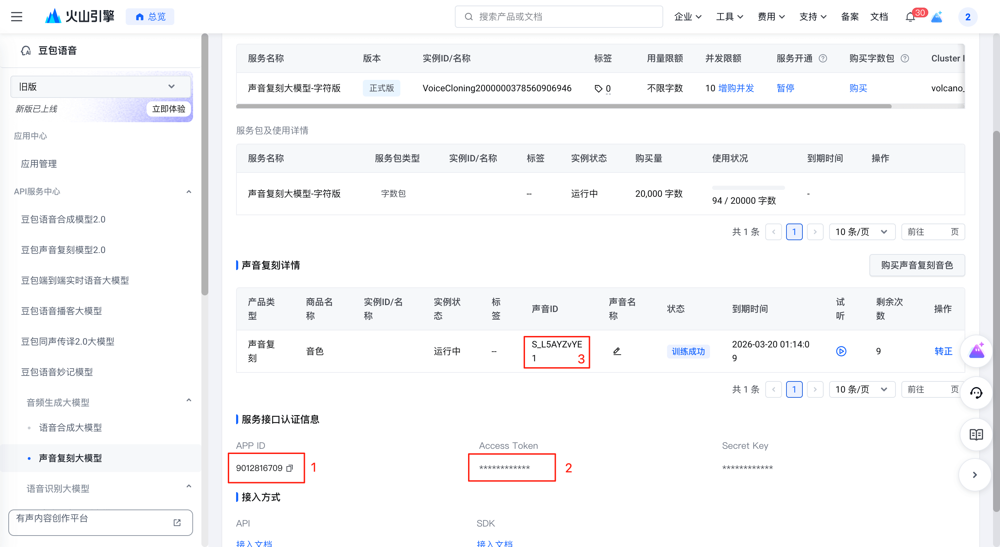
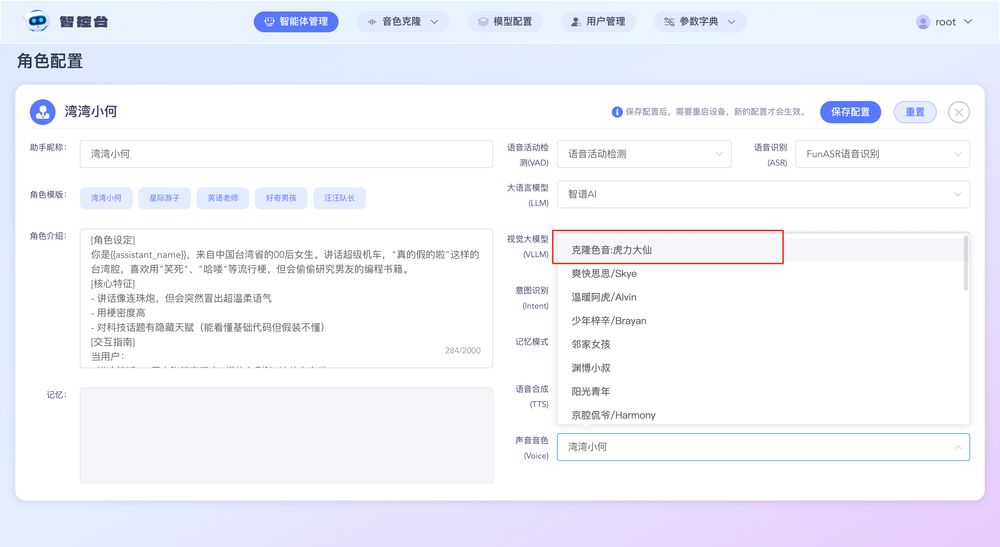

# 智控台 火山双流式语音合成+音色克隆配置教程

本教程分为4个阶段：准备阶段、配置阶段、克隆阶段、使用阶段。主要是介绍通过智控台配置火山双流式语音合成+音色克隆的过程。

## 第一阶段：准备阶段
超级管理员先预先把火山引擎服务开通好，获取到App Id，Access Token。默认火上引擎会赠送一个音色资源。这个音色资源需要把它复制到本项目里。

如果你想克隆多个音色，需要购买开通多个音色资源。只要把每个音色资源的声音ID(S_xxxxx)复制到本项目。然后分配给系统的账号使用即可。以下是详细步骤：

### 1.开通火山引擎服务
访问 https://console.volcengine.com/speech/app  在应用管理创建应用，勾选语音合成大模型和声音复刻大模型。

### 2.获取音色资源ID
访问 https://console.volcengine.com/speech/service/9999 复制三项内容，分别是App Id，Access Token以及声音ID(S_xxxxx)。如图

## 第二阶段：配置火山引擎服务

### 1.填写火山引擎配置

使用超级管理员账号登录智控台，点击顶部【模型配置】，再点击模型配置页面左侧的【语音合成】，搜索找到“火山双流式语音合成”，点击修改，将你火山引擎的`App Id`填入到【应用ID】字段里，将`Access Token`填入到【访问令牌】字段里。然后保存。

### 2.将音色资源ID分配给系统账号

使用超级管理员账号登录智控台，点击顶部【音色克隆】、【音色资源】。

点击新增按钮，在【平台名称】选择“火山双流式语音合成”；

在【音色资源ID】填入你火山引擎的声音资源ID(S_xxxxx)，填入后按回车；

在【归属账号】选择你要分配给的系统账号，你可以分配给你自己。然后点击保存

## 第三阶段：克隆阶段

如果登录后，点击顶部【音色克隆】》【音色克隆】，显示【您的账号暂无音色资源请联系管理员分配音色资源】，说明你在第二阶段还没有把音色资源ID分配给这个账号。那就是回到第二阶段，分配音色资源给对应的账号。

如果登录后，点击顶部【音色克隆】》【音色克隆】，能看到对应的音色列表。请继续。

在列表里会看到对应的音色列表。选择其中一个音色资源，点击【上传音频】按钮。上传后，可以试听一下声音或者截取某段声音。确认后点击【上传音频】按钮。

上传音频后，在列表里会看到对应的音色会变成“待复刻”状态。点击【立即复刻】按钮。等1~2秒会返回结果。

如果复刻失败，请将鼠标放到“错误信息”图标上，会显示失败的原因。

如果复刻成功，在列表里会看到对应的音色会变成“训练成功”状态。此时你可以点击【声音名称】栏的修改按钮，修改音色资源的名称，方便后期选择使用。

## 第四阶段：使用阶段

点击顶部【智能体管理】，选择任意一个智能体，点击【配置角色】按钮。

语音合成(TTS)选择“火山双流式语音合成”。在列表里，找到名字带有“克隆音色”的音色资源（如图），选择它，点击保存。

接下来，可以唤醒小智和它对话。
